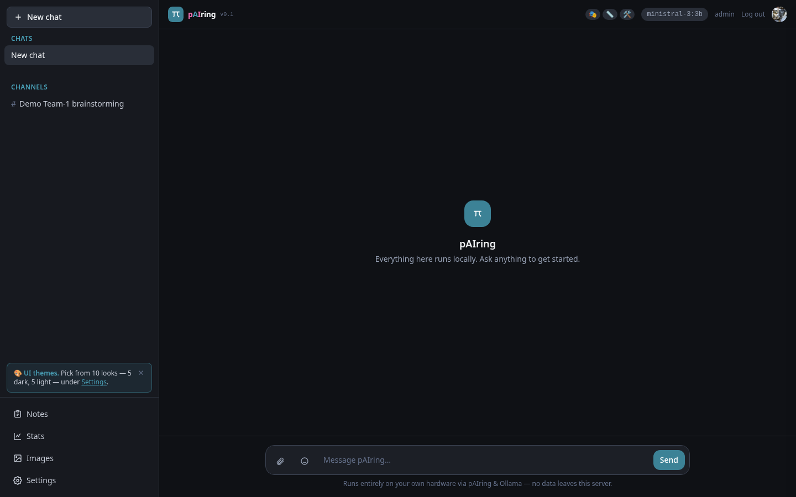
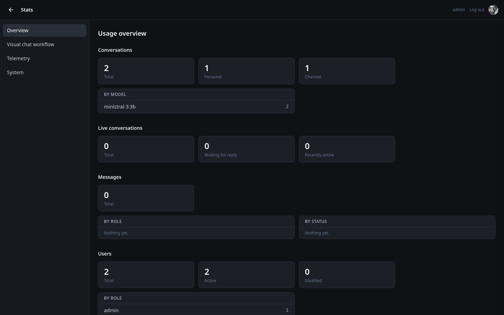
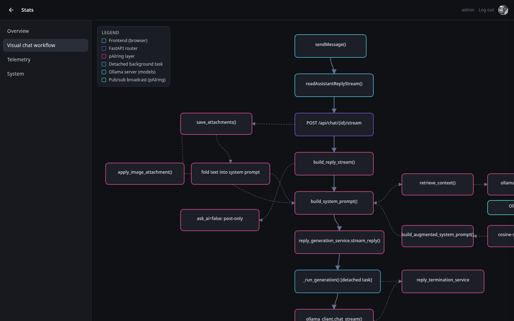
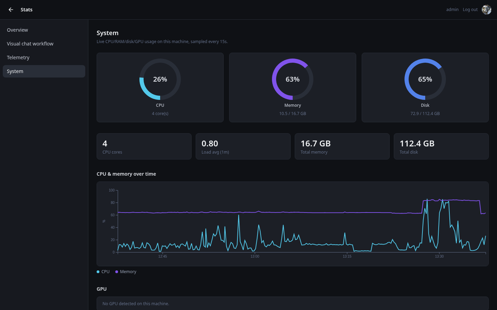
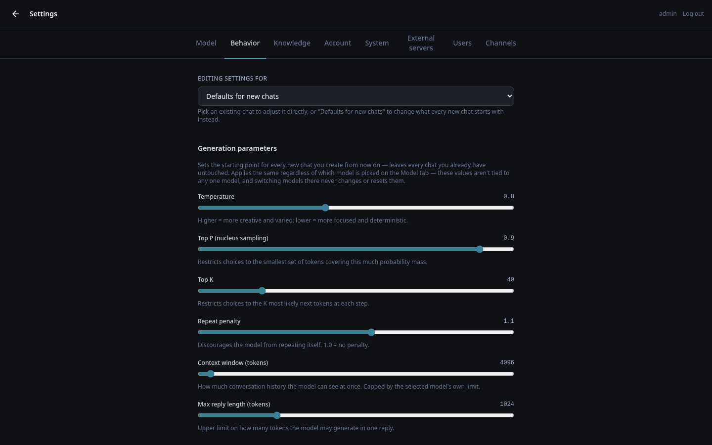
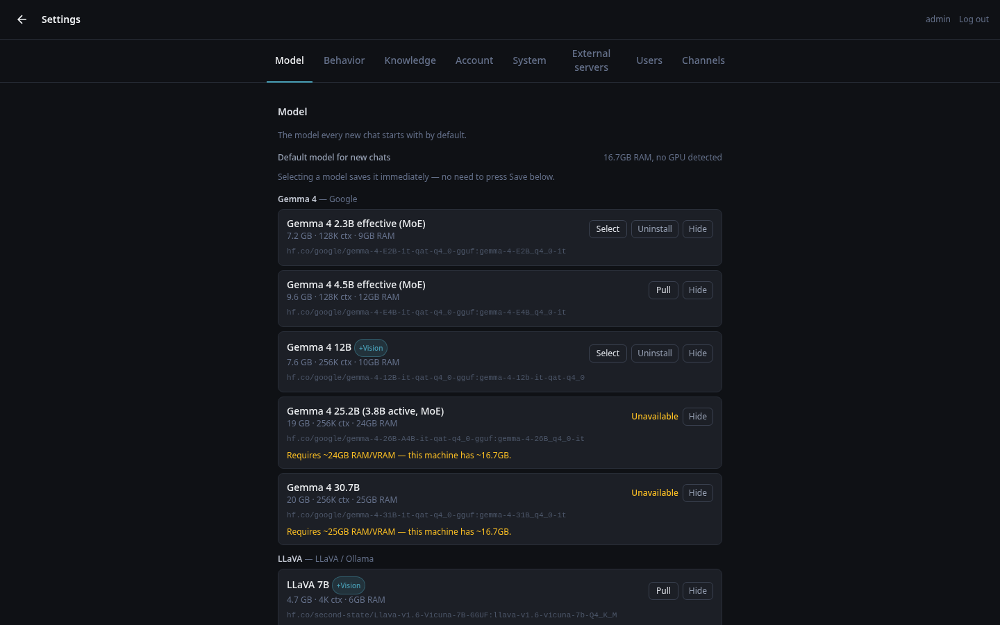
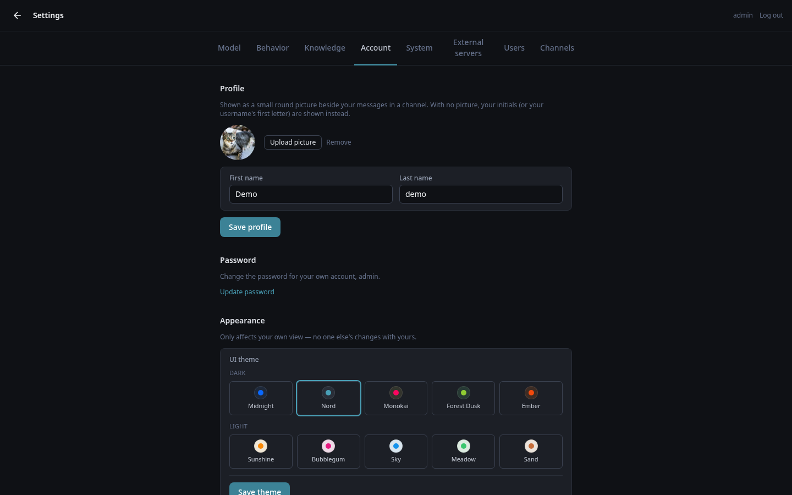
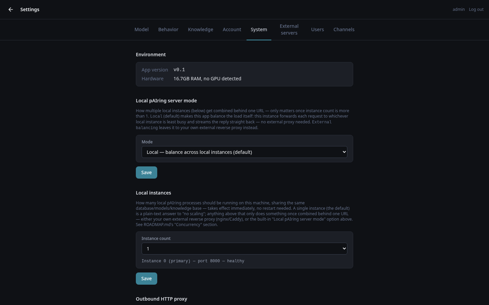

<br>
<div align="center">


</div>


# pAIring

Private AI ring is a self-hosted, production-ready platform for deploying private LLMs & image generation models across a single node, a team, a department, or an organization — role-based access, load balancing failover across servers, and rock solid UI validations to avoid configuration mistakes. Start chatting with open sourced LLMs, create images and much more. Supports every existing public GGUF model out of the box, browsable from Hugging Face or your own private repository. Nothing leaves your network.

## Quick start

```bash
python3 -m venv .venv
.venv/bin/pip install -r requirements.txt
cp .env.example .env   # then set a real SECRET_KEY — see README.md
.venv/bin/python run.py
```

Or just run `bash scripts/install.sh` (Linux/macOS) — same steps with extra validations.

Open **http://localhost:8000**, log in with the starter account, and
**change that password immediately** (Settings → Users) — whether
you're about to invite three friends or roll this out to a whole team.

Configure it as a system service: `scripts/pairing.service` is a
systemd unit template (Linux) — edit a couple of values and
`systemctl enable` it.

Full setup, MySQL migration, and multi-server deployment notes: see
[README.md](README.md).

## ✨ Features

**💬 Chat**
- Real-time streaming replies, with attachments (images + documents, up
  to 5 + 1 combined per message).
- Per-conversation model switching and generation parameters
  (temperature, top-p/k, context window, repeat penalty, reply length).
- Stop/cancel a reply mid-stream, smart or simple auto-titling.

**👥 Real multi-user, with shared Channels**
- Every user has private conversations no one else can see or list.
- **Channels** for shared, group conversations — a team standup, a
  student class testing models, whatever fits — with "live" (instant
  push).
- Per-channel managers — trusted members who can steer that channel's model/settings and pinned notes, without
  needing full admin rights over the whole system.

**🧠 Notes — persona / rules / skill**
- Reusable, pinnable notes that shape the system prompt per
  conversation — who the model is, what it must follow, what it's
  helping with — editable right from the chat header.

**📚 Knowledge base (RAG)**
- Drop in `.txt`/`.md`/`.pdf`/`.docx`/`.odt`/`.rtf`/`.html`/`.csv`/`.json`
  and every conversation can automatically search them — a household
  manual or a team's internal docs, same mechanism either way
- Private-per-user and shared/global scopes, with per-user storage
  quotas; answers cite which document they drew on.

**📊 Live dashboards**
- A real usage overview (conversations, messages, users, knowledge
  base).
- An interactive D3 diagram of the app's own request pipeline, click
  any step for detail — genuinely useful documentation.
- Telemetry data via OpenTelemetry (latency, tokens/sec, error
  rate, currently-loaded models) and live CPU/RAM/disk/GPU monitoring
  for the host — the kind of visibility that's nice to have and, for a
  shared/production deployment.

**🌓 Robust theme support**
- Robust themes schema, covering the whole app
- Pick one from Settings or the header, with instant live preview.

**🔐 Security, taken seriously either way**
- bcrypt password hashing, signed session cookies, login rate limiting,
  timing-safe unknown-username handling.
- Role-based access (admin/user); disabling an account keeps its
  history intact rather than deleting anything.
- SQLite out of the box, MySQL when you need more — switchable live.
- Outbound HTTP proxy support with encrypted-at-rest credentials.

**🖥️ GPU-aware**
- Live GPUs usage shows up right in the dashboard, alongside CPU/RAM/disk.

**⚖️ Load balancing**
- Point at extra Ollama servers (more GPUs, more machines) and this app spreads requests across them, with automatic failover if one goes down.
- Can also run multiple copies of itself behind one URL, no reverse proxy needed.
- Or, if you'd rather test it for enterprise use, use a reverse proxy (nginx, Caddy, ...) to balance across a ring of pAIring servers — that works too. All configurable directly from the UI.

**🛡️ Guardrails for admin changes**
- Risky settings (switching database, external servers) get tested before they're saved, so a bad edit doesn't take the UI down.
- If something's out of sync with what's actually running (like a hand-edited config file), you get updated.

**🎨 Image generation**
- Optional text-to-image Image generation,
  with browsable generation history (requires ComfyUI installed).
  
**🛠️ Nothing exotic to run**
- Plain HTML/CSS/JS + Tailwind's browser build — no Node, no build
  step, no extra services beyond the app itself.

**🔌 Efficient API — fully documented**
- The web UI is a client of pAIring's own JSON REST API — 90+ endpoints covering chat, channels,
  documents/RAG, notes, users, stats, telemetry, and every admin setting, so anything the UI can do, your own
  scripts/automation can do too.
- Live, interactive docs at `/docs` (Swagger UI) and `/redoc`, no separate setup — generated straight from the
  app's own OpenAPI schema at `/openapi.json`
- `GET /health` reports whether *this* instance can actually serve a chat request right now (Ollama reachable,
  database reachable), not just "is the process alive" — built for a load balancer or uptime monitor to poll.
- Same session-based login as the browser UI secures it — no separate API-key system (yet).

<br>

**💻 Runs on**
- Linux — All features installed.
- macOS also works — install Ollama yourself and point pAIring at it.
  Windows isn't supported at this point.
- x86_64 or arm64, GPU optional — CPU-only works fine, a GPU (NVIDIA or Apple Silicon) just makes replies much faster.
- No fixed RAM requirement — depends on which model(s) you run; Models settings section shows what actually fits your hardware.

<br><br>

## 📸 Screenshots

| Chat | Usage dashboard |
|---|---|
|  |  |

| Visual chat workflow (D3) | System resource monitor |
|---|---|
|  |  |

| Settings->behavior | Settings->models |
|---|---|
|  |  |

| Settings->account | Settings->system |
|---|---|
|  |  |


<br><br>


<br><br>

## License

[GNU AGPL-3.0](LICENSE) — you're free to run it, modify it, and
self-host it, no strings attached, for personal or internal use. The
one thing it asks in return: if you take a modified version and offer
it to other people as a hosted service, you share those changes back
too. If that's relevant to how you're planning to use this (it usually
isn't, for a personal setup or an internal company deployment), it's
worth a quick look either way.

If you try it, a ⭐ is always appreciated — and issues/PRs are genuinely
welcome, whoever you're running this for.

<!-- ================================================================ -->
